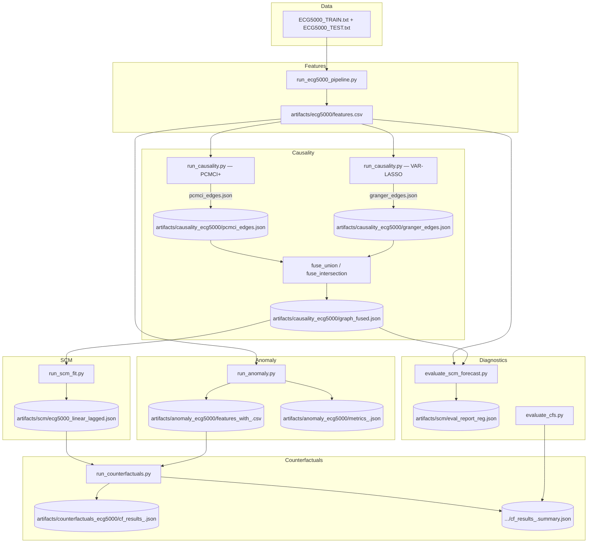

# Causal Counterfactual Explanations for Time-Series Anomaly Detection (ECG5000)

End-to-end pipeline to extract ECG features, learn causal structure, fit a linear lagged SCM, train anomaly models, and generate SCM-consistent counterfactuals with plausibility and strictness controls.

## Prerequisites

- OS: Linux/macOS/Windows
- Python: 3.10+
- Recommended: a virtual environment (venv/conda/uv)

Install dependencies:

```
pip install -r requirements_ecg.txt
```

## Quickstart (end-to-end)

If you have uv installed, you can run the entire pipeline end-to-end with sane defaults:

```
chmod +x scripts/run_end_to_end.sh
./scripts/run_end_to_end.sh
```

This will:
- extract features to `artifacts/ecg5000/features.csv`
- run causality and fuse a graph in `artifacts/causality_ecg5000/`
- fit a linear lagged SCM `artifacts/scm/ecg5000_linear_lagged.json`
- train an anomaly model and score the dataset
- generate SCM-consistent counterfactuals with strictness and save summaries
- write SCM forecast diagnostics (`artifacts/scm/eval_report_reg.json`)

Environment overrides (examples):

```
MAX_K=1 BOUNDS_LO=10 BOUNDS_HI=90 MAX_MAHA=4.0 ./scripts/run_end_to_end.sh
```

```

Dataset (UCR ECG5000):
- Download `ECG5000_TRAIN.txt` and `ECG5000_TEST.txt` from the UCR archive.
- Place both files in the `data/` directory:
  - `data/ECG5000_TRAIN.txt`
  - `data/ECG5000_TEST.txt`

## Architecture



## 1) Extract ECG5000 features

This computes time, frequency (Welch), morphological ECG, and ACF features. Optionally adds wavelet-based delineation (PR, QRS, QT, R_amp, T_amp).

```
python scripts/run_ecg5000_pipeline.py --data_dir data --out_dir artifacts/ecg5000
```

- Output: `artifacts/ecg5000/features.csv`

Tip: Add `--no_wavelet` for a faster first run.

## 2) Learn causal graph (PCMCI+ and VAR-LASSO fusion)

Run both PCMCI+ and VAR-LASSO Granger, then fuse (union or intersection). Use the ECG5000 features file created above.

```
python scripts/run_causality.py \
  --csv artifacts/ecg5000/features.csv \
  --fallback_csv artifacts/ecg5000/features.csv \
  --tau_max 5 --max_lag 5 --pc_alpha 0.05 --fdr fdr_bh \
  --fuse union \
  --outdir artifacts/causality_ecg5000
```

- Outputs (in `artifacts/causality_ecg5000/`):
  - `pcmci_edges.json`, `granger_edges.json`
  - `graph_fused.json` (used for SCM fitting)
  - `columns.json`

Optional graph visualization:

```
python scripts/visualize_graph.py \
  --edges artifacts/causality_ecg5000/graph_fused.json \
  --columns artifacts/causality_ecg5000/columns.json \
  --out artifacts/causality_ecg5000/graph_fused.png \
  --title "ECG5000 causal graph" --min_score 0.0
```

## 3) Fit a linear lagged SCM

Fits per-node linear regressions on lagged parents with optional regularization and standardized design. Save the model to the path that counterfactuals expect by default.

```
python scripts/run_scm_fit.py \
  --csv artifacts/ecg5000/features.csv \
  --edges artifacts/causality_ecg5000/graph_fused.json \
  --tau_max 3 \
  --method ridge --alpha 1.0 \
  --out artifacts/scm/ecg5000_linear_lagged.json
```

- Output: `artifacts/scm/ecg5000_linear_lagged.json`

Notes:
- `--method` can be `ols`, `ridge`, `lasso`, or `huber`.
- Choose `--tau_max` consistent with the lags used when building edges.

Optional SCM forecast diagnostics:

```
python scripts/evaluate_scm_forecast.py \
  --csv artifacts/ecg5000/features.csv \
  --edges artifacts/causality_ecg5000/graph_fused.json \
  --tau_max 3 --method ridge --alpha 1.0
```

The report includes per-node in-sample R², residual autocorrelation, design condition numbers/VIFs, and a simple temporal holdout (Granger-style) R² versus a null baseline.

## 4) Train and score an anomaly model

Trains IsolationForest (default), LOF (novelty), or One-Class SVM on train-split normal beats, then scores the full dataset.

Isolation Forest example:

```
python scripts/run_anomaly.py \
  --csv artifacts/ecg5000/features.csv \
  --model isoforest \
  --outdir artifacts/anomaly_ecg5000
```

- Outputs:
  - `artifacts/anomaly_ecg5000/features_with_isoforest.csv`
  - `artifacts/anomaly_ecg5000/metrics_isoforest.json`

Other models:
- LOF: `--model lof`
- OCSVM: `--model ocsvm --nu 0.1`

Optional calibration:

```
python scripts/run_anomaly.py \
  --csv artifacts/ecg5000/features.csv \
  --model isoforest \
  --calibrate
```

Adds a percentile-calibrated score column (`anomaly_score_<model>_cal`) using the validation split for consistent thresholds.

## 5) Generate SCM-consistent counterfactuals

Find minimal, plausible interventions (k variables) that flip the anomaly model to “normal,” honoring percentile bounds and optional Mahalanobis prioritization. Strictness constraints ensure flips are meaningful.

Single-feature (k=1) CFs for Isolation Forest, with plausibility and strictness (relaxed bounds to improve flip coverage):

```
python scripts/run_counterfactuals.py \
  --csv artifacts/anomaly_ecg5000/features_with_isoforest.csv \
  --scm artifacts/scm/ecg5000_linear_lagged.json \
  --model isoforest \
  --max_k 1 \
  --bounds_pct 0 100 \
  --prefer_mahalanobis \
  --cost_mode best --lambda_maha 0.1 \
  --priority spec_centroid spec_bw \
  --min_score_drop 0.05 \
  --max_maha 8.0 \
  --limit 200 \
  --outdir artifacts/counterfactuals_ecg5000
```

- Output: `artifacts/counterfactuals_ecg5000/cf_results_isoforest.json`

Two-feature (k=2) CFs (often closer but more complex):

```
python scripts/run_counterfactuals.py \
  --csv artifacts/anomaly_ecg5000/features_with_isoforest.csv \
  --scm artifacts/scm/ecg5000_linear_lagged.json \
  --model isoforest \
  --max_k 2 \
  --bounds_pct 0 100 --prefer_mahalanobis \
  --cost_mode best --lambda_maha 0.1 \
  --priority spec_centroid spec_bw \
  --min_score_drop 0.05 --max_maha 8.0 \
  --limit 200 \
  --outdir artifacts/counterfactuals_ecg5000
```

Advanced options:
- SCM consistency: `--max_resid_z 3.0` rejects CFs whose intervened residual z-score exceeds this threshold.
- Beam search for k>2: set `--max_k > 2` with `--beam_width 10` to enable approximate search with pruning.
- Influence paths are included in the CF JSON, listing ancestors of intervened features for causal context.

Cleanup

To clear generated outputs:

```
chmod +x scripts/clean_outputs.sh
./scripts/clean_outputs.sh   # prompts for confirmation
./scripts/clean_outputs.sh --force   # no prompt
```

Tips:
- Use `--pred_col anomaly_pred_<model>_normal_is_1` to target specific predicted anomalies if you’ve saved predictions in the CSV.
- Tighten plausibility: increase lower bound percentiles, decrease upper bound, or reduce `--max_maha`.
- Increase `--min_score_drop` to require more meaningful flips.

## 6) Summarize counterfactual quality

```
python scripts/evaluate_cfs.py --cf_json artifacts/counterfactuals_ecg5000/cf_results_isoforest.json
```

- Output: `artifacts/counterfactuals_ecg5000/cf_results_isoforest.summary.json`
- Metrics include: `flip_rate`, `mean_l2`, `mean_l1`, and `mean_score_delta` (bigger is a better reduction in anomaly score)

Note: Each CF JSON entry also includes `pred_orig` (1=normal, 0=anomaly) indicating the model's original prediction for that case.

## What’s happening under the hood

- Features: `src/feature_extraction.py`, `src/wavelet_based_delineation.py`, `src/data/ecg5000.py`
- Causality: `src/causality/pcmci_pipeline.py`, `src/causality/granger_var_lasso.py`, `src/causality/graph_fusion.py`
- SCM: `src/scm/learn_scm.py` learns linear lagged SCM with OLS/Ridge/Lasso/Huber; standardized design per node
- Anomaly models: `src/models/anomaly.py` (IsolationForest, LOF novelty, OCSVM with StandardScaler)
- Counterfactuals: `src/counterfactual/scm_cf.py` projects interventions through the SCM and searches plausible candidates using a composite cost (anomaly score + λ·Mahalanobis) with strictness checks
- Evaluation: `src/eval/metrics.py`

## Reproducibility and notes

- IsolationForest uses `random_state=0` for reproducibility.
- CF search is bounded using training percentiles; set `--bounds_pct` to calibrate plausibility.
- “Strict flips” require `--min_score_drop` and distance budgets (`--max_l2` or `--max_maha`) to avoid trivial but unrealistic solutions.

## Common issues

- Missing data files: ensure `data/ECG5000_TRAIN.txt` and `data/ECG5000_TEST.txt` exist.
- Tigramite not installed: install via the provided requirements file.
- Graph too sparse/dense: adjust `--pc_alpha`, `--fdr`, or switch `--fuse` between `union` and `intersection`.

## At-a-glance artifact paths

- Features: `artifacts/ecg5000/features.csv`
- Causality: `artifacts/causality_ecg5000/{pcmci_edges.json,granger_edges.json,graph_fused.json,columns.json}`
- SCM: `artifacts/scm/ecg5000_linear_lagged.json`
- Anomaly CSV: `artifacts/anomaly_ecg5000/features_with_<model>.csv`
- CFs: `artifacts/counterfactuals_ecg5000/cf_results_<model>.json` (+ `.summary.json`)

## Next steps (optional)

- Add an output "tag" flag to distinguish CF runs by hyperparameters.
- Include per-feature intervention frequencies in summaries.
- Extend to other datasets and domain-specific plausibility constraints.
